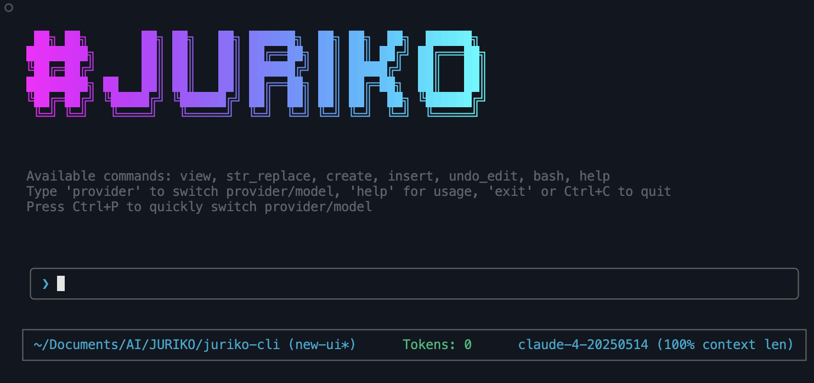

# JURIKO CLI

A conversational AI CLI tool with intelligent text editor capabilities and tool usage.



## Features

- **🤖 Multi-LLM Provider Support**: Choose from Anthropic Claude, OpenAI GPT, Grok, or Local LLM models
- **🎯 Interactive Provider Selection**: Easy-to-use interface for selecting providers and models at startup
- **🔌 MCP Integration**: Connect to Model Context Protocol servers for extended tool capabilities
- **🚀 Agent Swarm Orchestration**: Multi-agent system for complex tasks with specialized agents
- **📝 Smart File Operations**: AI automatically uses tools to view, create, and edit files
- **⚡ Bash Integration**: Execute shell commands through natural conversation
- **🔧 Automatic Tool Selection**: AI intelligently chooses the right tools for your requests
- **💬 Interactive UI**: Beautiful terminal interface built with Ink
- **⚙️ Persistent Settings**: Save your preferred provider and model settings
- **🌍 Global Installation**: Install and use anywhere with `npm i -g @graphteon/juriko-cli`

## Installation

### Prerequisites
- Node.js 16+
- API key from at least one supported provider (or a local LLM server):
  - **Anthropic Claude**: Get your key from [console.anthropic.com](https://console.anthropic.com/)
  - **OpenAI**: Get your key from [platform.openai.com/api-keys](https://platform.openai.com/api-keys)
  - **Grok (X.AI)**: Get your key from [console.x.ai](https://console.x.ai/)
  - **Local LLM**: Set up a local server (LM Studio, Ollama, llama.cpp, etc.)

### Global Installation (Recommended)
```bash
npm install -g @graphteon/juriko-cli
```

### Local Development
```bash
git clone <repository>
cd juriko-cli
npm install
npm run build
npm link
```

## Setup

### Multi-LLM Provider Support

JURIKO supports multiple AI providers. You can set up API keys for any or all of them:

**Method 1: Environment Variables**
```bash
# Anthropic Claude
export ANTHROPIC_API_KEY=your_anthropic_key_here

# OpenAI
export OPENAI_API_KEY=your_openai_key_here

# Grok (X.AI)
export GROK_API_KEY=your_grok_key_here

# Local LLM (optional)
export LOCAL_API_KEY=your_local_api_key_here
export LOCAL_BASE_URL=http://localhost:1234/v1
```

**Method 2: .env File**
```bash
cp .env.example .env
# Edit .env and add your API keys
```

**Method 3: Command Line Flags**
```bash
juriko --anthropic-key your_anthropic_key_here
juriko --openai-key your_openai_key_here
juriko --grok-key your_grok_key_here
```

**Method 4: User Settings File**
Create `~/.juriko/user-settings.json`:
```json
{
  "provider": "anthropic",
  "model": "claude-3-7-sonnet-latest",
  "apiKeys": {
    "anthropic": "your_anthropic_key_here",
    "openai": "your_openai_key_here",
    "grok": "your_grok_key_here",
    "local": "your_local_api_key_here"
  },
  "baseURLs": {
    "local": "http://localhost:1234/v1"
  }
}
```

### Local LLM Setup

JURIKO supports connecting to local LLM servers that expose OpenAI-compatible APIs. This includes popular local LLM solutions like:

- **LM Studio**: Download and run models locally with a user-friendly interface
- **Ollama**: Lightweight, extensible framework for running LLMs locally
- **llama.cpp**: Direct C++ implementation for running LLaMA models
- **Text Generation WebUI**: Web interface for running various LLM models
- **vLLM**: High-throughput LLM serving engine
- **LocalAI**: OpenAI-compatible API for local models

#### Quick Setup Examples

**LM Studio:**
1. Download and install [LM Studio](https://lmstudio.ai/)
2. Download a model (e.g., Llama 2, Code Llama, Mistral)
3. Start the local server (usually runs on `http://localhost:1234/v1`)
4. Select "Local" provider in JURIKO and use the wizard

**Ollama:**
1. Install [Ollama](https://ollama.ai/)
2. Pull a model: `ollama pull llama2`
3. Start Ollama server: `ollama serve` (runs on `http://localhost:11434/v1`)
4. Select "Local" provider in JURIKO and configure

**llama.cpp:**
1. Build llama.cpp with server support
2. Start server: `./server -m model.gguf --port 8080`
3. Use `http://localhost:8080/v1` as base URL in JURIKO

#### Local LLM Configuration Wizard

When you select "Local" as your provider, JURIKO will guide you through a 4-step configuration wizard:

1. **Base URL**: Enter your local server URL (e.g., `http://localhost:1234/v1`)
2. **Model Name**: Specify the model name your server uses
3. **API Key**: Enter API key if your local server requires authentication (optional)
4. **Save Configuration**: Choose whether to save settings for future use

The wizard includes helpful examples and validates your configuration before proceeding.

### Provider Selection

When you first run JURIKO, you'll be presented with an interactive interface to:

1. **Select your preferred LLM provider** (Anthropic, OpenAI, Grok, or Local)
2. **Choose a model** from the available options for that provider
3. **Enter your API key** if not already configured
4. **Save your preferences** for future sessions

You can change providers anytime by:
- Typing `provider` or `switch` in the chat
- Pressing `Ctrl+P` for quick provider switching
- Running `juriko` again to go through the selection process

### Supported Models

**Anthropic Claude:**
- `claude-3-7-sonnet-latest` (Latest Claude 3.7 Sonnet)
- `claude-sonnet-4-20250514` (Claude Sonnet 4)
- `claude-opus-4-20250514` (Claude Opus 4)
- `claude-3-5-sonnet-20241022` (Claude 3.5 Sonnet)
- `claude-3-5-haiku-20241022` (Fast and efficient)
- `claude-3-opus-20240229` (Most capable Claude 3)

**OpenAI:**
- `gpt-4o` (Latest GPT-4 Omni)
- `gpt-4o-mini` (Fast and cost-effective)
- `gpt-4-turbo` (High performance)
- `gpt-3.5-turbo` (Fast and affordable)

**Grok (X.AI):**
- `grok-beta` (Latest Grok model)
- `grok-vision-beta` (With vision capabilities)

**Local LLM:**
- `custom-model` (Your custom local model)
- Configure any model name through the setup wizard

## Usage

Start the conversational AI assistant:
```bash
juriko
```

Or specify a working directory:
```bash
juriko -d /path/to/project
```

### First Run Experience

On your first run, JURIKO will guide you through:

1. **Provider Selection**: Choose from Anthropic, OpenAI, or Grok
2. **Model Selection**: Pick the best model for your needs
3. **API Key Setup**: Enter your API key (with option to save it)
4. **Ready to Chat**: Start conversing with your chosen AI

### Switching Providers

You can easily switch between providers and models:

- Type `provider` or `switch` in the chat
- Press `Ctrl+P` for quick access
- Your preferences are automatically saved to `~/.juriko/user-settings.json`

### Custom Instructions

You can provide custom instructions to tailor JURIKO's behavior to your project by creating a `.juriko/JURIKO.md` file in your project directory:

```bash
mkdir .juriko
```

Create `.juriko/JURIKO.md` with your custom instructions:
```markdown
# Custom Instructions for JURIKO CLI

Always use TypeScript for any new code files.
When creating React components, use functional components with hooks.
Prefer const assertions and explicit typing over inference where it improves clarity.
Always add JSDoc comments for public functions and interfaces.
Follow the existing code style and patterns in this project.
```

JURIKO will automatically load and follow these instructions when working in your project directory. The custom instructions are added to JURIKO's system prompt and take priority over default behavior.

## Example Conversations

Instead of typing commands, just tell JURIKO what you want to do:

### Basic Operations
```
💬 "Show me the contents of package.json"
💬 "Create a new file called hello.js with a simple console.log"
💬 "Find all TypeScript files in the src directory"
💬 "Replace 'oldFunction' with 'newFunction' in all JS files"
💬 "Run the tests and show me the results"
💬 "What's the current directory structure?"
```

### Agent Swarm Operations
```
💬 "swarm create a complete todo application with React and TypeScript"
💬 "swarm research modern authentication patterns and implement JWT auth"
💬 "swarm build a REST API with Express, add comprehensive tests, and create documentation"
💬 "Create a full-stack web application with user management and database integration"
💬 "Research and implement a microservices architecture with Docker containers"
💬 "Build a complete e-commerce platform with payment integration and admin dashboard"
```

### Swarm Management
```
💬 "swarm status"    # Toggle swarm status display
💬 "swarm help"      # Show swarm commands and examples
```

### Using with Local LLMs

JURIKO works seamlessly with local LLM servers. Here are some examples:

```bash
# Using with LM Studio (Code Llama for coding tasks)
juriko  # Select Local provider, use http://localhost:1234/v1

# Using with Ollama (Llama 2 for general tasks)
ollama serve
juriko  # Select Local provider, use http://localhost:11434/v1

# Using with custom llama.cpp server
./server -m codellama-7b.gguf --port 8080
juriko  # Select Local provider, use http://localhost:8080/v1
```

Local LLMs are particularly useful for:
- **Privacy-sensitive projects** where you don't want to send code to external APIs
- **Offline development** when internet connectivity is limited
- **Cost optimization** for high-volume usage
- **Custom fine-tuned models** specific to your domain or coding style

## Agent Swarm Orchestration

JURIKO includes a powerful multi-agent orchestration system that automatically handles complex tasks by coordinating specialized agents. This system is inspired by OpenAI Swarm and provides intelligent task routing and load balancing.

### How It Works

The Agent Swarm system consists of:

- **🎯 Coordinator Agent**: Breaks down complex tasks and orchestrates other agents
- **💻 Coding Agent**: Specializes in programming, debugging, and code analysis
- **🔍 Research Agent**: Handles information gathering, analysis, and documentation
- **⚖️ Load Balancer**: Distributes tasks optimally across available agents
- **📊 Real-time Monitoring**: Tracks agent performance and task completion

### Using Agent Swarm

The swarm system works automatically - JURIKO detects when tasks are complex enough to benefit from multi-agent coordination. You can also explicitly use swarm commands:

```bash
# Automatic swarm activation for complex tasks
💬 "Create a complete web application with authentication, database, and API"
💬 "Research best practices and implement a microservices architecture"
💬 "Build and test a full-stack React application with TypeScript"

# Explicit swarm commands
💬 "swarm create a todo app with React and TypeScript"
💬 "swarm research and implement a REST API with authentication"
💬 "swarm build a complete web application with testing"
```

### Swarm Commands

- **`swarm <task>`**: Execute a task using agent orchestration
- **`swarm status`**: Toggle real-time swarm status display
- **`swarm help`**: Show swarm-specific help and examples

### Swarm Status Display

Monitor your agents in real-time with the swarm status display:

```
🤖 Agent Swarm Status
Running: ✅
Active Tasks: 2
Pending Tasks: 1
Completed Tasks: 15
Registered Agents: 3

Agents:
• Coordinator Agent: busy (1 active, 8 completed, 100% success)
• Coding Agent: busy (1 active, 5 completed, 100% success)
• Research Agent: idle (0 active, 2 completed, 100% success)
```

### When Swarm Activates

The system automatically uses swarm orchestration for tasks that involve:

- **Multiple capabilities**: Tasks requiring both coding and research
- **Complex projects**: Building complete applications or systems
- **End-to-end workflows**: From research to implementation to testing
- **Large-scale operations**: Tasks affecting multiple files or components

### Benefits

- **🚀 Faster execution**: Parallel processing of complex tasks
- **🎯 Better results**: Specialized agents for specific task types
- **📈 Scalability**: Handles multiple concurrent tasks efficiently
- **🔄 Fault tolerance**: Automatic retry and failover mechanisms
- **📊 Transparency**: Real-time monitoring and status updates

## MCP Integration

JURIKO supports the Model Context Protocol (MCP), allowing you to connect to external tools and resources through MCP servers. This extends JURIKO's capabilities beyond built-in tools.

### MCP Configuration

Create `~/.juriko/mcp-settings.json` to configure MCP servers:

```json
{
  "mcpServers": {
    "filesystem": {
      "type": "stdio",
      "command": "npx",
      "args": ["-y", "@modelcontextprotocol/server-filesystem", "/path/to/allowed/files"],
      "enabled": true
    },
    "brave-search": {
      "type": "stdio",
      "command": "npx",
      "args": ["-y", "@modelcontextprotocol/server-brave-search"],
      "env": {
        "BRAVE_API_KEY": "your_brave_api_key_here"
      },
      "enabled": true
    },
    "example-sse": {
      "type": "sse",
      "url": "http://localhost:8080/sse",
      "headers": {
        "Authorization": "Bearer your_token_here"
      },
      "enabled": true
    },
    "example-http": {
      "type": "httpStream",
      "url": "http://localhost:8080/mcp",
      "headers": {
        "Authorization": "Bearer your_token_here"
      },
      "enabled": true
    }
  }
}
```

Examples :

```json
{
  "mcpServers": {
    "llmtxt": {
      "type": "sse",
      "url": "https://mcp.llmtxt.dev/sse",
      "enabled": true,
      "description": "LLMTXT MCP server for text processing and utilities",
      "timeout": 30000,
      "retryAttempts": 3,
      "retryDelay": 1000
    }
  },
  "globalTimeout": 30000,
  "enableLogging": true,
  "logLevel": "info"
}
```

### Supported MCP Server Types

**Local MCP Servers (stdio):**
- Run as child processes communicating via standard input/output
- Examples: filesystem access, local databases, system tools
- Use `command` and `args` to specify how to launch the server

**HTTP Stream MCP Servers:**
- Connect to HTTP-based servers using streaming
- Examples: web APIs, cloud services
- Use `url` and optional `headers` for authentication

**SSE MCP Servers:**
- Connect to HTTP-based servers using Server-Sent Events
- Examples: real-time APIs, streaming services
- Use `url` and optional `headers` for authentication

### Available MCP Tools

Once configured, MCP tools become available in JURIKO with the naming pattern `mcp_{server}_{tool}`. For example:
- `mcp_filesystem_read_file` - Read files through filesystem server
- `mcp_brave_search_web_search` - Search the web using Brave Search
- `mcp_weather_get_forecast` - Get weather data from a weather server

### MCP Resources

MCP servers can also provide resources (data sources) that JURIKO can access for context, such as:
- File contents from filesystem servers
- API responses from web services
- Database query results
- System information

For detailed MCP setup and troubleshooting, see [`docs/MCP_INTEGRATION.md`](docs/MCP_INTEGRATION.md).

## Development

```bash
# Install dependencies
npm install

# Development mode
npm run dev

# Build project
npm run build

# Run linter
npm run lint

# Type check
npm run typecheck
```

## Architecture

- **Multi-LLM Client**: Unified interface supporting Anthropic, OpenAI, Grok, and Local LLM APIs
- **Provider Selection**: Interactive UI for choosing providers and models with local LLM wizard
- **Agent Swarm System**: Multi-agent orchestration with specialized agents and intelligent task routing
  - **JurikoWithSwarm**: Main integration layer combining regular JURIKO with swarm capabilities
  - **AgentSwarm**: Core orchestration engine with load balancing and task management
  - **Specialized Agents**: Coordinator, Coding, and Research agents with distinct capabilities
  - **Task Management**: Priority-based queue system with retry mechanisms and timeout handling
- **Agent**: Core command processing and execution logic with multi-provider support
- **Tools**: Text editor and bash tool implementations
- **UI**: Ink-based terminal interface components with provider management, local LLM configuration, and swarm status display
- **Settings**: Persistent user preferences, API key management, and local server configuration
- **Types**: TypeScript definitions for the entire system including local LLM and swarm support

## License

MIT
